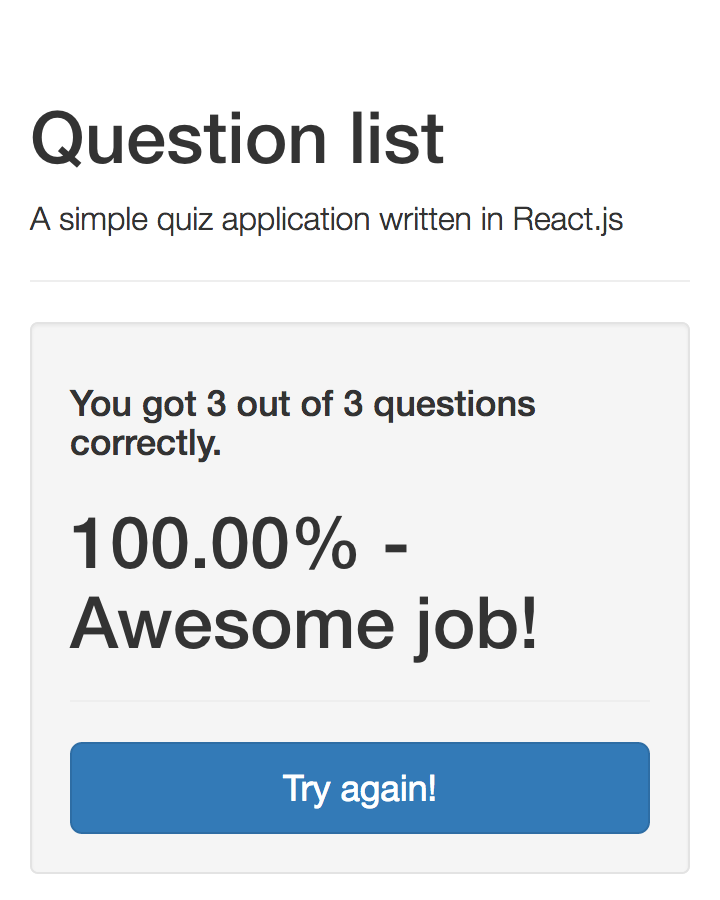

# Learning React
A repository where I drop code I create as I learn React I finished the Official Facebook Tutorial and Hacking with React. Currently doing exercises.

## InfoSearch

A React + Flux app that connects to the [Duck Duck Go API](https://duckduckgo.com/api) and does quick searches on it.


## Sticky notes

A Create/Read/Delete React + Flux application with persistence using MongoDB. Double clicking a post-it deletes it.


To deploy you'll need to create a file called **AppSecrets.js** in the `src/utils` with the following content:

**AppSecrets.js**
```js
const Secrets = {
  mongo: 'super-secret-mongolab-api-key-here',
};

export default Secrets;

```

## Firebase contact list

A Create/Read/Update/Delete React + Flux application with persistence using Firebase.


## IMDB movie finder (With Flux)

A movie finder that uses the IMDB API. While the application itself is quite trivial this was my first Flux application.


## Dynamic quiz application

An application that creates quizzes 100% dynamically based on structured JSON input.

###Question


###Result


## Github profile viewer

A github profile and repositories viewer. You can enter type new users at the top and it will load them, and it looks fairly pretty.

Everything used more than once is an individual component, and this is when I started to use stateless components a bit more heavily.


## Hacking with React

The [Hacking with React](http://www.hackingwithreact.com) code is located in: `hacking-with-react/hwr` and it can be run with:

```bash
webpack-dev-server
```

Tests can be run with:

```bash
npm run test
```

Link can be run with:

```bash
npm run lint
```

**Book Complete**

## Official facebook tutorial
The [Official facebook tutorial](https://facebook.github.io/react/docs/tutorial.html) code is located in `facebook-react-tutorial/react-tutorial` and can be run with any of the following.:

There are several simple server implementations included. They all serve static files from `public/` and handle requests to `/api/comments` to fetch or add data. Start a server with one of the following:

### Node

```sh
npm install
node server.js
```

### Python

```sh
pip install -r requirements.txt
python server.py
```

### Ruby
```sh
ruby server.rb
```

### PHP
```sh
php server.php
```

### Go
```sh
go run server.go
```

### Perl

```sh
cpan Mojolicious
perl server.pl
```

And visit <http://localhost:3000/>. Try opening multiple tabs!

**Exercise Complete**
